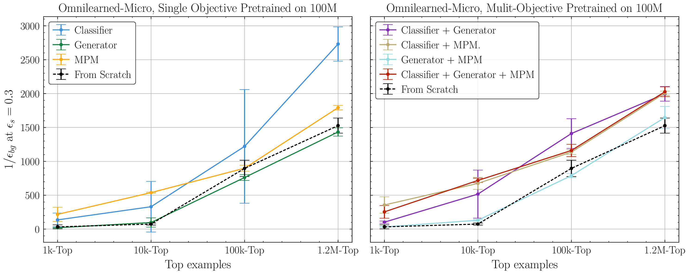
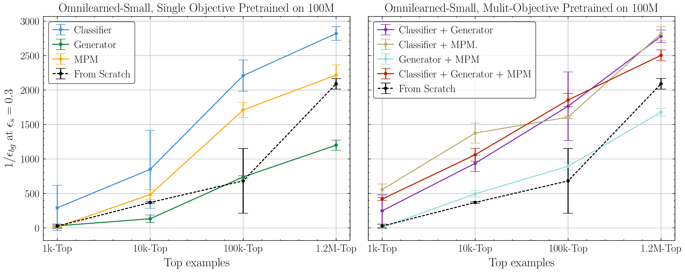
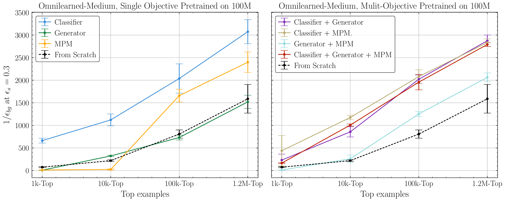
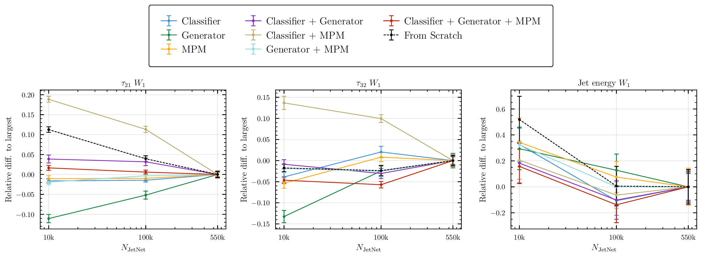
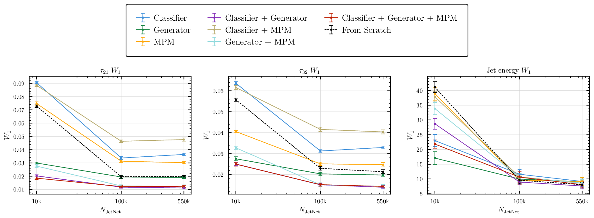
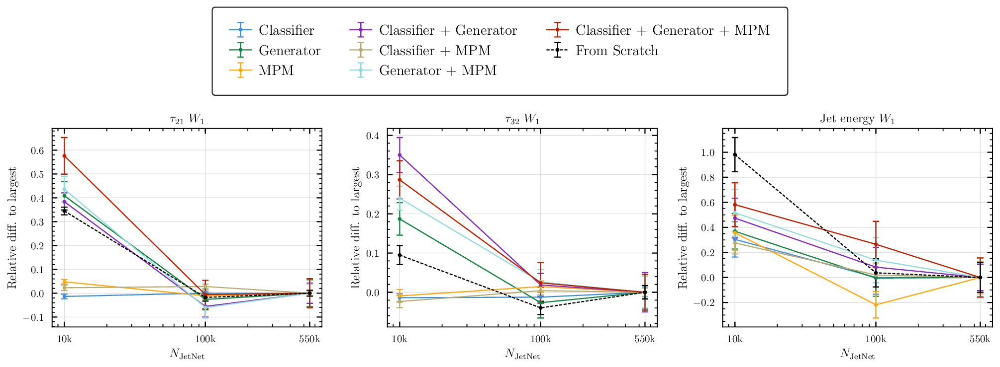

# Pre-Training for Science: A Study on Foundation Model Training Objectives

**Authors:** Ibrahim Elsharkawy, Joschka Birk, Vinicius Mikuni, Wahid Bhimji, Gregor Kasieczka, Benjamin Nachman

A study of how the choice of pre-training objective (classifier, generator, masked particle modeling (MPM), and their combinations) affects downstream performance of jet foundation models. Built on PyTorch Lightning, pre-trained on JetClass and fine-tuned on top tagging and JetNet generation.

Based on [OmniLearned](https://github.com/ViniciusMikuni/OmniLearned/tree/main).

```bibtex
@article{Bhimji:2025isp,
    author = "Bhimji, Wahid and Harris, Chris and Mikuni, Vinicius and Nachman, Benjamin",
    title = "{Foundation model framework for all tasks involving jet physics}",
    eprint = "2510.24066",
    archivePrefix = "arXiv",
    primaryClass = "hep-ph",
    doi = "10.1103/knmd-f5jm",
    journal = "Phys. Rev. D",
    volume = "113",
    number = "3",
    pages = "032020",
    year = "2026"
}
```

## Results

### Top tagging: background rejection vs. number of fine-tuning examples

Background rejection as more labeled top jets are made available, comparing single-objective (left) and multi-objective (right) pre-training against training from scratch.





### JetNet generation: quality vs. fine-tuning dataset size

Relative `W_1` distances versus the number of JetNet jets used for fine-tuning, per pre-training objective.





## Docker, environment

The container definition lives in [`docker/`](docker/): a [`Dockerfile`](docker/Dockerfile) (PyTorch 2.8 + CUDA 12.6, MPICH for Shifter, `vqtorch`) plus [`requirements.txt`](docker/requirements.txt) and [`requirements_jetnet.txt`](docker/requirements_jetnet.txt). On NERSC the prebuilt image is pulled via Shifter (`docker:jobirk/omnilearn-lightning:v1.0.4`).

## SLURM scripts

Job submission scripts for Perlmutter live in [`slurm_scripts/`](slurm_scripts/); each sets up the Shifter image and launches a script from [`scripts/`](scripts/).

| Script | Purpose |
| --- | --- |
| [`pretrain.sh`](slurm_scripts/pretrain.sh) | Pre-train a model on JetClass under a chosen objective (`classifier`, `generator`, `mpm`, combinations, `point_lejepa`, …). |
| [`pretrain_debug.sh`](slurm_scripts/pretrain_debug.sh) | Same as above on the short `debug` queue for quick test runs. |
| [`finetune.sh`](slurm_scripts/finetune.sh) | Fine-tune pre-trained models on top tagging across dataset sizes, seeds, and objectives. |
| [`finetune_debug.sh`](slurm_scripts/finetune_debug.sh) | Debug-queue version of the top-tagging fine-tuning sweep. |
| [`finetune_gen.sh`](slurm_scripts/finetune_gen.sh) | Fine-tune for generation on JetNet (jetnet30 / jetnet150). |
| [`finetune_gen_debug.sh`](slurm_scripts/finetune_gen_debug.sh) | Debug-queue version of the generation fine-tuning sweep. |
| [`evaluate.sh`](slurm_scripts/evaluate.sh) | Evaluate fine-tuned checkpoints and write results JSON. |
| [`finetune_pretrain_sweep.sh`](slurm_scripts/finetune_pretrain_sweep.sh) | Sweep across pre-training checkpoints (every Nth val-loss step) of one run, fine-tuning each on the downstream task and copying the best checkpoints out. |
| [`evaluate_pretrain_sweep.sh`](slurm_scripts/evaluate_pretrain_sweep.sh) | Evaluate the fine-tuned checkpoints produced by the pre-train sweep, writing per-step results to an eval JSON. |
| [`benchmark.sh`](slurm_scripts/benchmark.sh) | Throughput/scaling benchmark of the model across node/GPU configurations. |
